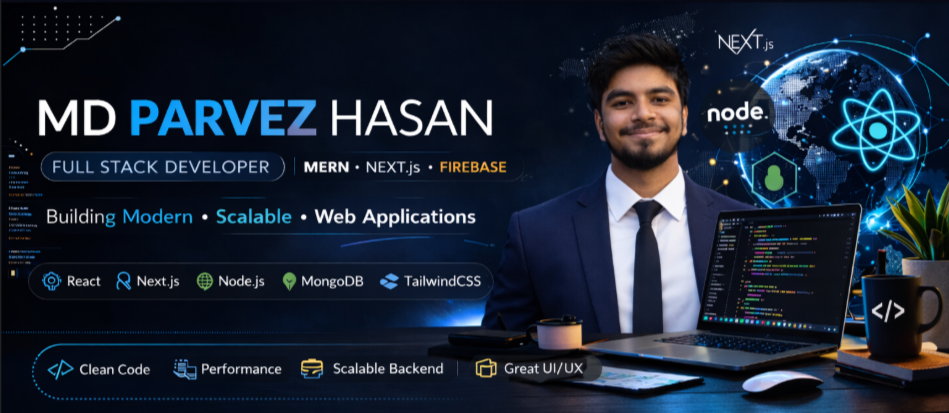

  

<h1 align="center">Hi 👋, I'm Md Parvez Hasan</h1>
<h3 align="center">🚀 Full Stack Developer | MERN Stack | Next.js</h3>

---

# 🌐 Connect With Me

---

# 👨‍💻 About Me

Hi there! I'm **Md Parvez Hasan** — a passionate **Full Stack Developer (MERN Stack)** from **Bangladesh** who loves building modern, scalable, and user-friendly web applications.

🎓 **BSc in Computer Science & Engineering**  
Chittagong University of Engineering and Technology

🚀 Currently building **CourseHub** — a modern course management platform using **Next.js, Firebase, and TailwindCSS**

💻 Skilled in **React, Next.js, Node.js, Express.js, MongoDB, JavaScript, and TypeScript**

🌱 Currently exploring **Advanced Next.js, System Design, and Scalable Backend Development**

🎯 Actively seeking **Entry-Level / Junior Full Stack Developer opportunities** to contribute, learn, and grow in a professional development team.

📍 Based in **Chattogram, Bangladesh**

💬 Ask me about **React, Next.js, Node.js, and MERN stack development**

📫 Reach me at **parvezyesrat17032024@gmail.com**

🌐 Portfolio  
**https://my-portfolio-orpin-alpha-41.vercel.app/**
---
# ⚡ Quick Highlights

✔ MERN Stack Developer  
✔ 3+ Full Stack Projects  
✔ Competitive Programming (LeetCode / Codeforces)  
✔ Strong in React Ecosystem  
✔ Passionate about clean UI & scalable backend systems

---
# 🚀 Tech Stack

### 👨‍💻 Languages

### 🌐 Frontend

### ⚙️ Backend

### 🗄 Database

### 🛠 Tools

---

# 📊 GitHub Stats

---

# 🔥 GitHub Streak

---

# 🏆 GitHub Trophies

---

# 📈 Contribution Graph

---

# 👀 Profile Views

---

⭐️ From **Md Parvez Hasan**
